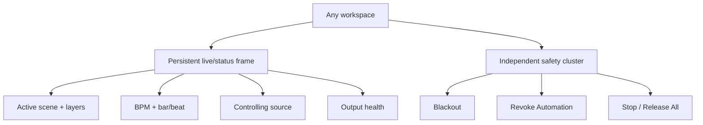

# GOLC Operator Workflow Map

## Primary End-to-End Flow

```mermaid
flowchart LR
    A["Open or create show"] --> B["Patch workspace"]
    B --> C["Choose fixture definitions"]
    C --> D["Build logical pools"]
    D --> E["Map deployment instances"]
    E --> F{"Impact plan valid?"}
    F -- "Revise" --> D
    F -- "Apply" --> G["Program workspace"]
    G --> H["Create reusable looks"]
    H --> I["Create scenes and assign layers"]
    I --> J["Preview / evaluate at bar position"]
    J --> K{"Ready for operator?"}
    K -- "Revise" --> G
    K -- "Yes" --> L["Build constrained operator surface"]
    L --> M["Map keyboard / MIDI controls"]
    M --> N["Perform workspace"]
    N --> O["Run show"]
```



## Persistent Live-Control Contract



## Workspace Ownership

| User intent | Primary workspace | Context panel | Must remain visible |
|-------------|-------------------|---------------|---------------------|
| Adapt a show to a venue | Patch | Selected pool, fixture, deployment, impact plan | Output state + safety |
| Build or revise looks | Program | Selected scene, layer, look, fixture scope | Active scene + timing + safety |
| Hand off a show | Perform | Surface assignment / MIDI mapping overlay | Authorization + live state + safety |
| Run a show | Perform | Selected scene/layer/master | Source + output + timing + safety |
| Configure networking | Setup | Selected interface/target | Output state + safety |
| Diagnose MIDI | Setup | Selected port/mapping | Live state + safety |

## Keyboard Focus Model

```text
Ctrl+1..4     Switch Patch / Program / Perform / Setup
F6            Cycle global frame → workspace navigator → canvas → inspector
Arrow keys    Move within scene, layer, list, or grid collections
Enter         Open/activate selected item according to workspace
Space         Transport action only when focus is not in an editable control
Esc           Close transient panel / cancel learn / return focus to canvas
?             Contextual shortcut and help overlay
```

Emergency shortcuts remain fixed and global within the application window as defined by Phase 6.

