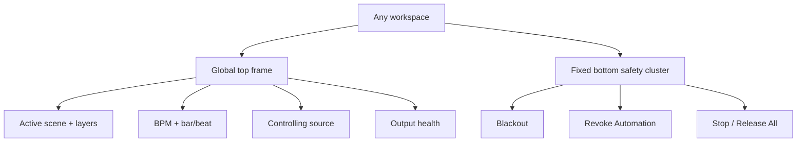

# GOLC Operator Workflow Map

**Note (2026-07-27):** updated to match the shipped Show/Build/Operate/Output
command-rail shell (`frontend/src/shell/navigation.ts`,
`.planning/sketches/references/application-shell-navigation.md`), replacing the
pre-restructure Patch/Program/Perform/Setup workspace model this document
originally described.

## Primary End-to-End Flow


```mermaid
flowchart LR
    A["Show: Overview / Save & Recovery"] --> B["Build: Fixture Library"]
    B --> C["Choose fixture definitions"]
    C --> D["Build: Patch & Pools"]
    D --> E["Map deployment instances"]
    E --> F{"Impact plan valid?"}
    F -- "Revise" --> D
    F -- "Apply" --> G["Build: Scenes & Looks"]
    G --> H["Create reusable looks"]
    H --> I["Create scenes and assign layers"]
    I --> J["Preview / evaluate at bar position"]
    J --> K{"Ready for operator?"}
    K -- "Revise" --> G
    K -- "Yes" --> L["Operate: Operator Surface"]
    L --> M["Operate: MIDI Mapping"]
    M --> N["Output: Art-Net / Diagnostics"]
    N --> O["Run show"]
```

`Build: Scripts` (TypeScript automation, Phase 8) sits alongside `Scenes &
Looks` in the Build group and is not on the primary authoring path above — it
is opt-in automation layered on top of the same command model, not a
replacement step in it.

## Persistent Live-Control Contract


```mermaid
flowchart TB
    W["Any workspace"] --> S["Global top frame"]
    S --> T["Active scene + layers"]
    S --> U["BPM + bar/beat"]
    S --> V["Controlling source"]
    S --> X["Output health"]
    W --> Y["Fixed bottom safety cluster"]
    Y --> B["Blackout"]
    Y --> R["Revoke Automation"]
    Y --> Q["Stop / Release All"]
```

Per the shell's interaction contract: selecting a command-rail destination
replaces only the central workspace and inspector — it never mutates show
playback or output. The top frame and bottom safety cluster stay mounted
across every workspace.

## Command Rail Groups

| Group | Destinations | Primary intent |
|-------|---------------|-----------------|
| Show | Overview, Save & Recovery, Settings | Show identity, persistence, recovery |
| Build | Fixture Library, Patch & Pools, Scenes & Looks, Scripts | Adapt a show to a venue; build/revise looks; author automation |
| Operate | Operator Surface, MIDI Mapping | Hand off a show; configure/learn MIDI |
| Output | Art-Net, Diagnostics | Configure networking; inspect output/frame health |

Regardless of which destination is active, the global top frame (show
identity/save state, transport, BPM, bar/beat, controlling source, active
scene, output health) and the fixed bottom safety cluster (Stop/Release-All,
Revoke Automation, Blackout) remain visible per the shell's interaction
contract.

## Keyboard Model

GOLC has no per-workspace keyboard focus model or nav-switching shortcut
(`Ctrl+1..4`/`F6` from this document's pre-restructure draft were never
implemented). What actually shipped (`frontend/src/hooks/useKeyboardWorkflow.ts`,
mounted globally by `frontend/src/shell/useGlobalKeyboardWorkflow.ts` so it
fires regardless of which command-rail destination is active) is the
documented PLAY-02 playback shortcut set:

```text
1 – 9    Switch to the Nth scene in the current show
Q        Toggle Base Look on the active scene
W        Toggle Color Theme on the active scene
E        Toggle Chase on the active scene
R        Toggle Motion on the active scene
Space    Tap tempo (accumulates with prior taps within 2s)
↑ / ↓    Nudge BPM up / down by 1
Enter    Evaluate/preview the active scene at bar 0
?        Toggle the keyboard-shortcuts help overlay
Esc      Close the help overlay
```

All of the above are suppressed while focus is in an input, textarea, or
contenteditable element. The safety cluster (Blackout, Revoke Automation,
Stop/Release-All) is mouse/touch-activated in the shipped UI, not bound to a
dedicated keyboard shortcut — see `frontend/src/components/KeyboardShortcuts`
for the live, code-sourced reference panel (it reads `PLAYBACK_SHORTCUTS`
directly so this document and the actual bindings cannot drift apart the way
this file itself once did).
