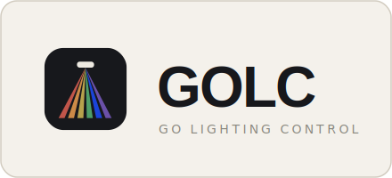

<p align="center">
  <picture>
    <source media="(prefers-color-scheme: dark)" srcset="docs/brand/golc-card-dark.svg">
    
  </picture>
</p>

# GOLC

A modern lighting-control application for operators of small live shows — clubs, churches, schools, and community venues — built in Go with a Wails desktop interface.

GOLC combines a fast, modular show-authoring workflow with TypeScript scripting, autonomous LLM control, and a well-documented API, so people, scripts, external programs, and AI agents can all create and operate fixture patches, scenes, chases, and show playback through the same system. The first release targets Windows and outputs Art-Net.

> **Status: early development.** GOLC is being built in dependency-ordered phases. Phases 1–5 are complete: offline configuration and delivery traceability, modular fixtures and deployments, deterministic show programming and playback, observable Art-Net output, and durable show storage/recovery are implemented and tested. Phase 6 (Wails Authoring and Operator Surface) is next — there is no desktop UI yet, so GOLC is not usable end-to-end as a lighting console.

## Why GOLC

The project is motivated by frustration with QLC+: show setup takes too long, the workflow feels clunky, and it lacks real scripting. GOLC's core value proposition:

> An operator can author a modular show once, adapt its fixture pools to different deployments in one or two actions, and hand a simple controller surface to another person for reliable playback.

The primary workflow is front-loaded show authoring followed by repeated deployment. A show is reusable with all or a subset of the available fixtures, and pool-size changes update dependents through a reviewable impact plan instead of manual reprogramming.

## Planned capabilities (v1)

- **Complete show workflow** — patch fixtures, organize attributes, build looks/scenes and chases, play them back, save and restore shows.
- **Modular fixture pools** — shows model reusable logical pools independently of a deployment's concrete fixture count and addresses; replacement fixtures map by semantic capability (intensity, color, position, beam) rather than raw channel numbers, with review before commit.
- **Human-readable fixture definitions** — a strict, schema-validated YAML 1.2 subset with duplicate-key rejection and deterministic normalization; import from [Open Fixture Library](https://open-fixture-library.org/) plus first-class custom definitions.
- **Tempo-aware scenes** — bar-based loops synchronized to a global BPM (typed or tap tempo), with independently swappable color themes, chases, and motion presets blended through reusable transition presets.
- **Reliable Art-Net output** — deterministic playback and frame output that never depend on UI rendering, storage, scripts, API clients, or LLM inference.
- **Operator surfaces** — full keyboard and on-screen playback, plus a constrained generic MIDI surface (Note/CC learn, soft takeover) that a less-experienced operator can learn quickly.
- **TypeScript automation** — create, run, and debug capability-limited scripts in a supervised, isolated runtime using a generated typed SDK.
- **Versioned external API** — external programs inspect and control every public capability through `/api/v1`, with the same typed command model as the desktop app.
- **Provider-neutral AI** — hosted or local LLMs can draft fixture definitions and, under an explicitly armed, time-bounded lease, operate the application — always validated, audited, and subject to immediate operator override (**Revoke Automation**).

Out of scope for v1: protocols beyond Art-Net, multi-user/distributed operation, browser or mobile clients, and official macOS/Linux support (portability is preserved architecturally; Windows is qualified first).

## Architecture principles

- **One typed command model.** UI actions, TypeScript scripts, API clients, and LLM tools all route through shared domain commands, so every control surface behaves consistently.
- **Deterministic output path.** Playback timing and Art-Net output are isolated from everything else — a stalled UI, slow script, or unreachable LLM provider cannot delay or corrupt frames.
- **Review before structural change.** Pool resizing and fixture substitution default to a deterministic impact preview before anything is applied; nothing is approximated silently.
- **Operator authority is local.** Revoke Automation blocks AI and scripts, cancels their queued actions, and freezes the current look without waiting on any runtime or provider. Blackout is a separate immediate intensity control.
- **Offline-safe delivery tracking.** Planning artifacts keep durable local identities; Linear reconciliation runs through credential-external tooling and never blocks local work.

## Getting started (contributors)

The only supported entrypoint is `golc.ps1` (Windows PowerShell 5.1), run from the repository root. No ecosystem tool — `go`, `npm`, or anything else — is invoked directly, and after the first bootstrap everything works offline.

```powershell
# One-time: provision the pinned project-local toolchain
powershell -NoProfile -File .\golc.ps1 bootstrap

# Inspect committed configuration (deterministic JSON)
powershell -NoProfile -File .\golc.ps1 config inspect runtime --format json

# Set a machine-local override (written to git-ignored golc.local.toml)
powershell -NoProfile -File .\golc.ps1 config set --local runtime.log_level debug

# Explain which layer wins for an effective value
powershell -NoProfile -File .\golc.ps1 config explain runtime.log_level --format json

# Run quick tests for a registered scope
powershell -NoProfile -File .\golc.ps1 test --quick --scope config-local
```

Bootstrap verifies every tool archive against committed SHA-256 pins in `config/toolchain.toml`, installs into a repository-local `.tools/` directory with atomic promotion, and never rewrites `go.mod`, `go.sum`, or the pin manifest. A second bootstrap with matching install manifests makes zero network calls.

See [docs/development.md](docs/development.md) for the full contributor walkthrough.

## Configuration model

[golc.project.toml](golc.project.toml) is the root configuration index. It holds only schema and index metadata and points at logically separated concern files, each of which alone owns its values:

| Concern | File |
|---------|------|
| Toolchain pins | [config/toolchain.toml](config/toolchain.toml) |
| Commands | [config/commands.toml](config/commands.toml) |
| Generation | [config/generation.toml](config/generation.toml) |
| Application defaults | [config/application-defaults.toml](config/application-defaults.toml) |
| Runtime | [config/runtime.toml](config/runtime.toml) |
| Linear integration | [config/integrations/linear.toml](config/integrations/linear.toml) |

Machine-local overrides live in `golc.local.toml` (git-ignored, atomically written, strictly validated). Cross-concern values use typed `ref:<canonical.key>` references so no authoritative value is duplicated. A clean checkout contains no secrets or machine-local state.

## Repository layout

```
cmd/golc-project/     Project CLI that golc.ps1 delegates to
config/               Committed configuration concern files
docs/                 Contributor documentation
internal/bootstrap    Pinned-toolchain bootstrap (checksum-verified, atomic)
internal/command      Command router, config and test routes
internal/projectconfig  Strict concern decoding, layered resolution
internal/trace        Planning identity catalog (Linear traceability)
tests/                Acceptance tests and data-only fixtures
.planning/            GSD planning artifacts (project, roadmap, state, phases)
```

## Roadmap

| # | Phase | Status |
|---|-------|--------|
| 1 | Offline Foundation and Delivery Traceability | Complete |
| 2 | Modular Fixtures and Deployments | Complete |
| 3 | Deterministic Show Programming and Playback | Complete |
| 4 | Observable Art-Net Live Output | Complete |
| 5 | Durable Shows and Recovery | Complete |
| 6 | Wails Authoring and Operator Surface | **Not started (next)** |
| 7 | Versioned External Control API | Not started |
| 8 | Isolated TypeScript Automation | Not started |
| 9 | Provider-Neutral AI and Bounded Autonomy | Not started |
| 10 | Windows Release Qualification | Not started |
| 11 | Telemetry, Usage Statistics, and Auto Crash Submission Pipeline | Not started |

Full phase goals and success criteria live in [.planning/ROADMAP.md](.planning/ROADMAP.md).

## Tech stack

- **Core:** Go (module `github.com/lnorton89/golc`)
- **Desktop UI:** Wails (planned, Phase 6)
- **Output protocol:** Art-Net 4 (delivered, Phase 4)
- **Scripting:** TypeScript in an isolated, capability-limited runtime (planned, Phase 8)
- **Fixture format:** strict YAML 1.2 subset with versioned schemas
- **Show storage:** single-file, versioned SQLite `.golc` store with rotating recovery points and verified-backup schema migration (delivered, Phase 5)
- **Delivery tracking:** Linear, reconciled offline-safe from repository-owned identities
