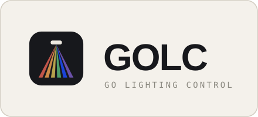

<p align="center">
  <picture>
    <source media="(prefers-color-scheme: dark)" srcset="docs/brand/golc-card-dark.svg">
    
  </picture>
</p>

# GOLC

A modern lighting-control application for club/DJ operators running small live shows, built in Go with a Wails desktop interface.

GOLC combines a fast, modular show-authoring workflow with TypeScript scripting, autonomous LLM control, and a well-documented API, so people, scripts, external programs, and AI agents can all create and operate fixture patches, scenes, chases, and show playback through the same system. The first release targets Windows and outputs Art-Net.

> **Status: early development, pre-alpha.** GOLC ships in dependency-ordered phases; see [Roadmap](#roadmap). **v1.0 (Phases 1–8) shipped 2026-07-27** — the deterministic core: offline configuration and delivery traceability, modular fixtures and deployments, deterministic show programming and playback, observable Art-Net output, durable show storage/recovery, the full Wails authoring and operator surface (on-screen and keyboard playback, the safety cluster, the operator-surface builder, and generic MIDI Note/CC learn with soft takeover, verified against real hardware), the versioned external `/v1` control API (Chi+Huma, scoped API-key auth, revision-checked/dry-run/idempotent mutations and atomic batching, revisioned SSE, and a drift-checked generated OpenAPI contract), and isolated capability-limited TypeScript scripting (sandboxed Deno runtime, generated typed SDK, Monaco editor, and a real CDP source-mapped step debugger) are implemented and tested. Phases 9–11 (provider-neutral AI autonomy, Windows release qualification, telemetry) are planned next; see `.planning/MILESTONES.md`.

## TL;DR

No installer exists yet (pre-alpha) — this builds and runs GOLC from source. Requires [Go](https://go.dev/dl/) already installed.

```bash
# 1. Install Mage once (needs GOPATH/bin, usually ~/go/bin, on your PATH)
go install github.com/magefile/mage@v1.17.2

# 2. Provision everything else and build the CLI + desktop app
mage Bootstrap
mage Build

# 3. Run it. `mage Bootstrap` already provisioned the midicat helper
#    golc-desktop needs on PATH just to START (not just to use MIDI — see
#    "MIDI requires midicat" below); `mage Run` is what actually puts it
#    on PATH for the process that needs it.
mage Run
```

If `mage` "isn't recognized" after step 1, your shell's PATH doesn't include Go's bin directory yet — open a **new** terminal (PATH changes don't apply retroactively), or check `go env GOPATH` and add `<that path>\bin` to PATH yourself.

#### MIDI requires `midicat`

MIDI hardware itself is optional — GOLC's full playback workflow works from keyboard and on-screen controls alone. But the underlying driver library (`gomidi/midicatdrv`) panics at process startup if its `midicat` helper binary isn't on PATH, even when you have no MIDI controller and never touch the MIDI UI. This is a known upstream limitation (a hard crash from a package `init()`, not a recoverable error — see `internal/midi/driver.go`'s doc comment for the full analysis). `mage Bootstrap` provisions `midicat` automatically (`config/toolchain.toml`'s `[go_install.midicat]`) into the project-local `.tools/cache/go-bin`, and **`mage Run` is the launcher that actually puts that directory on PATH for `golc-desktop`'s own process** — nothing inside `golc-desktop` itself can do this, since the panic happens in a package `init()` that runs before its `main()` ever gets a chance to fix PATH.

Running the compiled binary directly instead of `mage Run` (`./golc-desktop` / `.\golc-desktop.exe`, e.g. after copying it out of the repo) is **not** covered by this fix: it inherits whatever PATH the invoking shell already has, same as any other program. If you go that route, make sure `.tools/cache/go-bin` (or wherever `go install gitlab.com/gomidi/tools/midicat@v1.0.7` put the binary) is on PATH yourself first. This is a real, currently-open gap for a future packaged end-user launcher — see `.planning/phases/06-wails-authoring-and-operator-surface/deferred-items.md`.

That's the whole app. For the CLI's config/test/docs commands, the full command surface, and every Mage target, see [Getting started](#getting-started-contributors) and [Running GOLC](#running-golc) below.

## Contents

- [TL;DR](#tldr)
- [Why GOLC](#why-golc)
- [Planned capabilities (v1)](#planned-capabilities-v1)
- [Architecture principles](#architecture-principles)
- [Getting started (contributors)](#getting-started-contributors)
- [Running GOLC](#running-golc)
- [Installing on Linux](#installing-on-linux)
- [Configuration model](#configuration-model)
- [Repository layout](#repository-layout)
- [Roadmap](#roadmap)
- [Tech stack](#tech-stack)
- [Contributing](#contributing)
- [License](#license)

## Why GOLC

The project is motivated by frustration with QLC+: show setup takes too long, the workflow feels clunky, and it lacks real scripting. GOLC's core value proposition:

> An operator can author a modular show once, adapt its fixture pools to different deployments in one or two actions, and hand a simple controller surface to another person for reliable playback.

The primary workflow is front-loaded show authoring followed by repeated deployment. A show is reusable with all or a subset of the available fixtures, and pool-size changes update dependents through a reviewable impact plan instead of manual reprogramming.

## Planned capabilities (v1)

- **Complete show workflow** — patch fixtures, organize attributes, build looks/scenes and chases, play them back, save and restore shows.
- **Modular fixture pools** — shows model reusable logical pools independently of a deployment's concrete fixture count and addresses; replacement fixtures map by semantic capability (intensity, color, position, beam) rather than raw channel numbers, with review before commit.
- **Human-readable fixture definitions** — a strict, schema-validated YAML 1.2 subset with duplicate-key rejection and deterministic normalization; import from [Open Fixture Library](https://open-fixture-library.org/) plus first-class custom definitions.
- **Tempo-aware scenes** — bar-based loops synchronized to a global BPM (typed or tap tempo), with independently swappable color themes, chases, and motion presets blended through reusable transition presets.
- **Reliable Art-Net output** — deterministic playback and frame output that never depend on UI rendering, storage, scripts, API clients, or LLM inference.
- **Operator surfaces** — full keyboard and on-screen playback, plus a constrained generic MIDI surface (Note/CC learn, soft takeover) that a less-experienced operator can learn quickly.
- **TypeScript automation** — create, run, and debug capability-limited scripts in a supervised, isolated runtime using a generated typed SDK.
- **Versioned external API** — external programs inspect and control every public capability through `/api/v1`, with the same typed command model as the desktop app.
- **Provider-neutral AI** — hosted or local LLMs can draft fixture definitions and, under an explicitly armed, time-bounded lease, operate the application — always validated, audited, and subject to immediate operator override (**Revoke Automation**).

Out of scope for v1: protocols beyond Art-Net, multi-user/distributed operation, browser or mobile clients, and official macOS/Linux support (portability is preserved architecturally; Windows is qualified first).

## Architecture principles

- **One typed command model.** UI actions, TypeScript scripts, API clients, and LLM tools all route through shared domain commands, so every control surface behaves consistently.
- **Deterministic output path.** Playback timing and Art-Net output are isolated from everything else — a stalled UI, slow script, or unreachable LLM provider cannot delay or corrupt frames.
- **Review before structural change.** Pool resizing and fixture substitution default to a deterministic impact preview before anything is applied; nothing is approximated silently.
- **Operator authority is local.** Revoke Automation blocks AI and scripts, cancels their queued actions, and freezes the current look without waiting on any runtime or provider. Blackout is a separate immediate intensity control.
- **Offline-safe delivery tracking.** Planning artifacts keep durable local identities; Linear reconciliation runs through credential-external tooling and never blocks local work.

## Getting started (contributors)

The sole supported entrypoint is [Mage](https://magefile.org/) (`magefiles/magefile.go`), run from the repository root. No ecosystem tool — `npm` or anything else — is invoked directly, and after the first bootstrap everything works offline. The build/dev tooling itself is genuinely cross-platform: `mage Bootstrap`/`Build`/`Test`/`PackageFoundation` are verified working on Windows, Linux, and macOS in CI (`.github/workflows/cross-platform-mage.yml`) — see the [platform note](#platform-note) below for what that does and doesn't mean for the GOLC *application*.

```bash
# One-time (ambient install): Go plus Mage pinned to config/toolchain.toml's version
go install github.com/magefile/mage@v1.17.2

# One-time: provision the rest of the pinned project-local toolchain
mage Bootstrap
```

Bootstrap verifies every tool archive against committed SHA-256 pins in `config/toolchain.toml`, installs into a repository-local `.tools/` directory with atomic promotion, and never rewrites `go.mod`, `go.sum`, or the pin manifest. A second bootstrap with matching install manifests makes zero network calls.

### Every Mage target

| Target | What it does |
|---|---|
| `mage Bootstrap` | Provisions every pinned project-local tool (Go, Node, Mage itself) and builds `golc-project`. Set `GOLC_BOOTSTRAP_INCLUDE_LINEAR_SYNC=1` first to also build the isolated Linear-sync Node workspace. |
| `mage Generate` | Writes every registered schema (`schemas/*.json`, `docs/reference/*`) to its committed path. |
| `mage GenerateCheck` | Reports generated-file drift without writing — what CI runs. |
| `mage Check` | Runs the strict project configuration concern check. |
| `mage CheckOffline` | Runs `generate`, `check`, `build`, and `test --quick` in order with network access denied — the offline core graph. |
| `mage Build` | Compiles every project package, including `cmd/golc-desktop`; rebuilds the embedded frontend first if any frontend source changed. |
| `mage Lint` | Runs `golangci-lint` over every project Go package with the project-local pinned toolchain. |
| `mage Dev` | Runs `wails dev` (hot-reload desktop dev loop) with the pinned Go/Node/Wails toolchains prepended onto its PATH. |
| `mage Run` | Launches the already-built `golc-desktop[.exe]` with `.tools/cache/go-bin` (where `midicat` is provisioned) prepended onto the PATH of that child process — see [MIDI requires `midicat`](#midi-requires-midicat). |
| `mage Test` | Runs the complete test route: the full Go suite plus every registered Node scope (requires the Linear-sync workspace bootstrap above). |
| `mage TestQuick` | Fast `go vet`-only quick test route — never touches Node scopes or the Linear process-transport tests, so it works without the Linear-sync bootstrap opt-in. |
| `mage Package` / `mage PackageFoundation` | Builds the deterministic developer-tool foundation ZIP (`dist/foundation/`) — see [Configuration model](#configuration-model)'s `commands.toml`. Windows-AMD64-specific by design (a developer-tool bundle, not a cross-platform release artifact). |
| `mage Pr` | Runs the exact ordered graph `config/commands.toml`'s `commands.pr.steps` declares, serially — what `check.yml`'s CI job does step by step, runnable locally. |

`mage -l` lists all targets from any checkout; `golc_list_mage_targets` (via [tools/golc-mcp](tools/golc-mcp)) gives the same inventory, plus route/argument/network-policy detail, to MCP-aware tools.

A handful of routes (`config inspect`/`set`/`explain`, `test --quick --scope <name>`, `docs`, `linear preview`/`drift`/`apply`) take open-ended arguments (any concern name, any dotted key, any registered scope) that no fixed Mage target can model — Mage targets are fixed, no-argument Go functions — so they go directly through the pinned CLI binary Bootstrap just compiled, at `.tools/installs/golc_project/<platform>/bin/golc-project[.exe]` (`<platform>` is `windows-amd64`, `linux-amd64`, `linux-arm64`, `darwin-amd64`, or `darwin-arm64`). Alias it once per shell session instead of retyping the full path:

```bash
# bash/zsh
alias golc="$(pwd)/.tools/installs/golc_project/<platform>/bin/golc-project"
```

```powershell
# PowerShell
function golc { & "$PWD\.tools\installs\golc_project\windows-amd64\bin\golc-project.exe" @args }
```

```bash
# Inspect committed configuration (deterministic JSON)
golc config inspect runtime --format json

# Set a machine-local override (written to git-ignored golc.local.toml)
golc config set --local runtime.log_level debug

# Explain which layer wins for an effective value
golc config explain runtime.log_level --format json

# Run quick tests for a registered scope
golc test --quick --scope config-local
```

See [docs/development.md](docs/development.md) for the full contributor walkthrough.

## Running GOLC

> GOLC is pre-alpha (see the status note at the top of this README) — there is no installer or release build yet. "Running it" today means building from source and launching the binaries yourself.

### Desktop app

```bash
mage Build   # compiles every project package, including cmd/golc-desktop
mage Run     # launches golc-desktop[.exe] with midicat correctly on PATH
```

`mage Build` (via `mage Bootstrap`, which always builds the frontend first) produces `golc-desktop[.exe]` — the Wails desktop shell with the operator surface, safety cluster, and playback controls. Prefer `mage Run` to launch it: it prepends the project-local `.tools/cache/go-bin` (where `mage Bootstrap` installs `midicat`) onto the child process's own PATH before exec, which is what actually keeps `golc-desktop` from panicking on startup — see [MIDI requires `midicat`](#midi-requires-midicat) in the TL;DR. Launching the compiled binary directly (`./golc-desktop` / `.\golc-desktop.exe`) instead skips that PATH fixup entirely and is only safe if you've put `midicat` on PATH yourself first.

### CLI

`golc-project` (the same binary [Getting started](#getting-started-contributors) above uses for `config`/`test`/`docs`) also exposes the full show-authoring and control surface as scriptable routes: fixture patching (`fixture`), pools and deployments (`pool`, `deployment`), scenes and chases (`scene`, `programming`), playback (`playback`), operator surfaces (`operatorsurface`), and Art-Net output (`artnet`). This is the same typed command model the desktop UI, TypeScript scripts, and (later) the external API all route through — see [Architecture principles](#architecture-principles). Every route is self-registered and discoverable live rather than hand-documented in a second place:

```bash
golc docs   # generates docs/reference/*.md from source (see the alias set up above)
```

[docs/reference/](docs/reference/) (regenerated by the command above) has the per-package reference; `golc_list_command_routes` and `golc_list_mage_targets` (via [tools/golc-mcp](tools/golc-mcp), a read-only MCP server over this repository) give the same inventory to MCP-aware tools without grepping source.

### Platform note

Windows is the only platform this project's [ROADMAP](.planning/ROADMAP.md) qualifies for a v1 release — that's a product-support decision (Phase 10), not a build limitation. The Go code and CLI build and pass their full test suite on Windows, Linux, and macOS (proven continuously in CI); the desktop app's platform-specific pieces (global hotkeys, packaging) are written per-OS, but macOS/Linux builds of it are unqualified and untested end-to-end — build and run them yourself at your own risk, don't expect support. See [Installing on Linux](#installing-on-linux) below for the system-package requirements and a known unpatched upstream limitation.

## Installing on Linux

> As noted in [Platform note](#platform-note) above, Linux is not a qualified v1 platform — this is "how to build it yourself," not a supported install path. The CLI (`golc-project`) is fully buildable and testable on Linux with no GTK/WebKit dependency; the desktop app (`golc-desktop`) additionally needs system packages, one of which (`webkit2gtk-4.0`) is unavailable on several current distributions with no confirmed fix — see [Desktop app: the `webkit2gtk-4.0` problem](#desktop-app-the-webkit2gtk-40-problem) below before investing time in it.

### Building just the CLI

`golc-project` never imports `internal/wails` (the Wails/hotkey package) at all, so it has **no system-package dependency whatsoever** — not X11, not GTK, not WebKit. `mage Bootstrap` builds exactly this binary (see [Every Mage target](#every-mage-target) — it never touches `cmd/golc-desktop`), so on a bare Linux box with nothing but Go available:

```bash
go install github.com/magefile/mage@v1.17.2
mage Bootstrap
```

leaves you a working CLI at `.tools/installs/golc_project/linux-<arch>/bin/golc-project`, ready to alias per [Getting started (contributors)](#getting-started-contributors). No further steps, no system packages, and it works identically whether or not the packages in the next two sections are ever installed.

`mage Build` (and `mage Test`, `mage Dev`, `mage Run`) is a different story: those compile or link **every** project package, including `cmd/golc-desktop`, so they pull in everything below even if you only care about the CLI.

### System packages (needed for `mage Build`/`mage Test`/the desktop app)

`golang.design/x/hotkey`'s Linux backend (used by `internal/wails` for the safety-cluster global shortcuts) `cgo`-links against `X11/Xlib.h` at **build** time and connects to a real X11 `DISPLAY` from a package `init()` at **process start** time.

```bash
# Debian/Ubuntu
sudo apt-get update
sudo apt-get install -y libx11-dev xvfb

# Fedora/RHEL
sudo dnf install -y libX11-devel xorg-x11-server-Xvfb

# Arch
sudo pacman -S --needed libx11 xorg-server-xvfb
```

If you're on a headless machine (CI, SSH, containers) with no real X server, start a virtual one before running `golc-desktop` or `mage Test`:

```bash
Xvfb :99 -screen 0 1024x768x24 &
export DISPLAY=:99
```

This exact sequence (`libx11-dev` + `Xvfb`) is what [.github/workflows/cross-platform-mage.yml](.github/workflows/cross-platform-mage.yml) runs on `ubuntu-latest` for every PR — see that file for the always-current, CI-verified command.

### Desktop app: the `webkit2gtk-4.0` problem

GOLC pins Wails v2 (`v2.13.0`), which links against `webkit2gtk-4.0` via `pkg-config`. On a distribution that still ships it:

```bash
# Debian 12 / Ubuntu 22.04 and earlier
sudo apt-get install -y libgtk-3-dev libwebkit2gtk-4.0-dev

# Fedora 39 and earlier
sudo dnf install -y gtk3-devel webkit2gtk3-devel
```

Several current distributions (NixOS unstable, Ubuntu 24.04+, Fedora 40+, Linux Mint 22+) have dropped `webkit2gtk-4.0` in favor of `webkit2gtk-4.1` (upstream WebKitGTK deprecated the 4.0 API series, which depends on the also-deprecated libsoup2). Wails does have a `-tags webkit2_41` build flag intended for this, but as of this writing it lands only on the Wails v3 (alpha) line, not v2 — a v2.10.2 user confirmed in October 2025 that `-tags webkit2_41` did not fix the build on a webkit2gtk-4.1-only system ([wailsapp/wails#4661](https://github.com/wailsapp/wails/issues/4661); the flag's origin: [wailsapp/wails#3345](https://github.com/wailsapp/wails/issues/3345)). **There is currently no confirmed working fix for building GOLC's desktop app against `webkit2gtk-4.1` on Wails v2.** If your distribution has already removed `webkit2gtk-4.0`, the only known workaround is providing an older package snapshot that still has it (e.g. on Nix, pinning a `nixpkgs` channel/commit that predates the removal). This is also why `.github/workflows/cross-platform-mage.yml`'s `ubuntu-latest` job doesn't install GTK/WebKit at all — the hosted runner's current Ubuntu image has already dropped `webkit2gtk-4.0`, so there is nothing to install that would fix it, and the job is `continue-on-error: true` for exactly this reason (see [Platform note](#platform-note)).

Once the GTK/WebKit and X11 packages above are installed, building and running the desktop app works the same as [Running GOLC](#running-golc) describes for any platform:

```bash
mage Build
mage Run
```

If `webkit2gtk-4.0` genuinely isn't available on your system, building the CLI ([above](#building-just-the-cli)) is the only currently-working option.

## Configuration model

[golc.project.toml](golc.project.toml) is the root configuration index. It holds only schema and index metadata and points at logically separated concern files, each of which alone owns its values:

| Concern | File |
|---------|------|
| Toolchain pins | [config/toolchain.toml](config/toolchain.toml) |
| Commands | [config/commands.toml](config/commands.toml) |
| Generation | [config/generation.toml](config/generation.toml) |
| Application defaults | [config/application-defaults.toml](config/application-defaults.toml) |
| Runtime | [config/runtime.toml](config/runtime.toml) |
| Linear integration | [config/integrations/linear.toml](config/integrations/linear.toml) |

Machine-local overrides live in `golc.local.toml` (git-ignored, atomically written, strictly validated). Cross-concern values use typed `ref:<canonical.key>` references so no authoritative value is duplicated. A clean checkout contains no secrets or machine-local state.

## Repository layout

```
cmd/golc-project/       Project CLI Mage bootstraps/delegates to
cmd/golc-desktop/       Wails desktop entrypoint
frontend/               React/TypeScript operator surface (Wails UI)
config/                 Committed configuration concern files
docs/                   Contributor documentation
internal/bootstrap      Pinned-toolchain bootstrap (checksum-verified, atomic)
internal/command        Command router, config and test routes
internal/projectconfig  Strict concern decoding, layered resolution
internal/trace          Planning identity catalog (Linear traceability)
internal/fixture        Fixture definitions, pools, deployments
internal/show           Show authoring, storage, and recovery
internal/programming    Scenes, chases, and playback programming
internal/playback       Deterministic show-state and playback loader
internal/artnet         Art-Net output and daemon supervision
internal/midi           Generic MIDI Note/CC learn and soft takeover
internal/operatorsurface  Shared operator-facing command surface
internal/wails          Wails host lifecycle and daemon supervision
tests/                  Acceptance tests and data-only fixtures
.planning/              GSD planning artifacts (project, roadmap, state, phases)
```

## Roadmap

| # | Phase | Status |
|---|-------|--------|
| 1 | Offline Foundation and Delivery Traceability | Complete |
| 2 | Modular Fixtures and Deployments | Complete |
| 3 | Deterministic Show Programming and Playback | Complete |
| 4 | Observable Art-Net Live Output | Complete |
| 5 | Durable Shows and Recovery | Complete |
| 6 | Wails Authoring and Operator Surface | Complete |
| 7 | Versioned External Control API | Complete |
| 8 | Isolated TypeScript Automation | Complete |
| 9 | Provider-Neutral AI and Bounded Autonomy | Not started |
| 10 | Windows Release Qualification | Not started |
| 11 | Telemetry, Usage Statistics, and Auto Crash Submission Pipeline | Not started |

Full phase goals and success criteria live in [.planning/ROADMAP.md](.planning/ROADMAP.md).

## Tech stack

- **Core:** Go (module `github.com/lnorton89/golc`)
- **Desktop UI:** Wails, React, TypeScript, Zustand (delivered, Phase 6)
- **Output protocol:** Art-Net 4 (delivered, Phase 4)
- **Operator input:** generic MIDI Note/CC learn with soft takeover (delivered, Phase 6 — verified against real hardware)
- **External control:** versioned HTTP API (Chi + Huma, OpenAPI-generated) (delivered, Phase 7)
- **Scripting:** TypeScript in an isolated, capability-limited runtime (delivered, Phase 8)
- **Fixture format:** strict YAML 1.2 subset with versioned schemas
- **Show storage:** single-file, versioned SQLite `.golc` store with rotating recovery points and verified-backup schema migration (delivered, Phase 5)
- **Delivery tracking:** Linear, reconciled offline-safe from repository-owned identities

## Contributing

Bug reports and design discussion are welcome via issues. GOLC is pre-alpha and the architecture is still settling each phase, so please open an issue before sending a large pull request. See [docs/development.md](docs/development.md) for the contributor walkthrough and [AGENTS.md](AGENTS.md) for repository conventions.

## License

GOLC is licensed under the [GNU General Public License v3.0](LICENSE).
